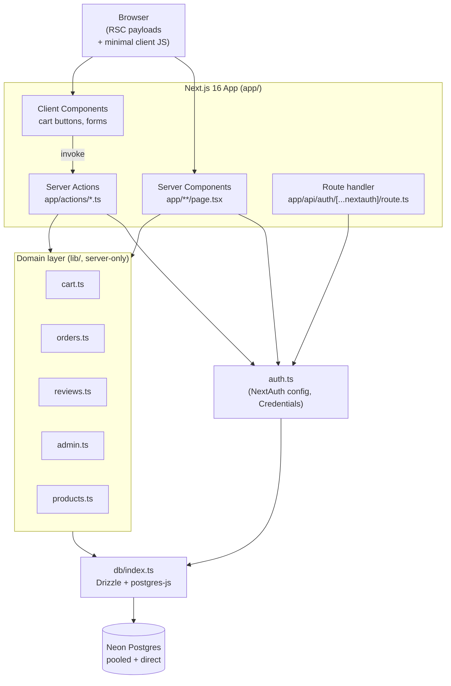
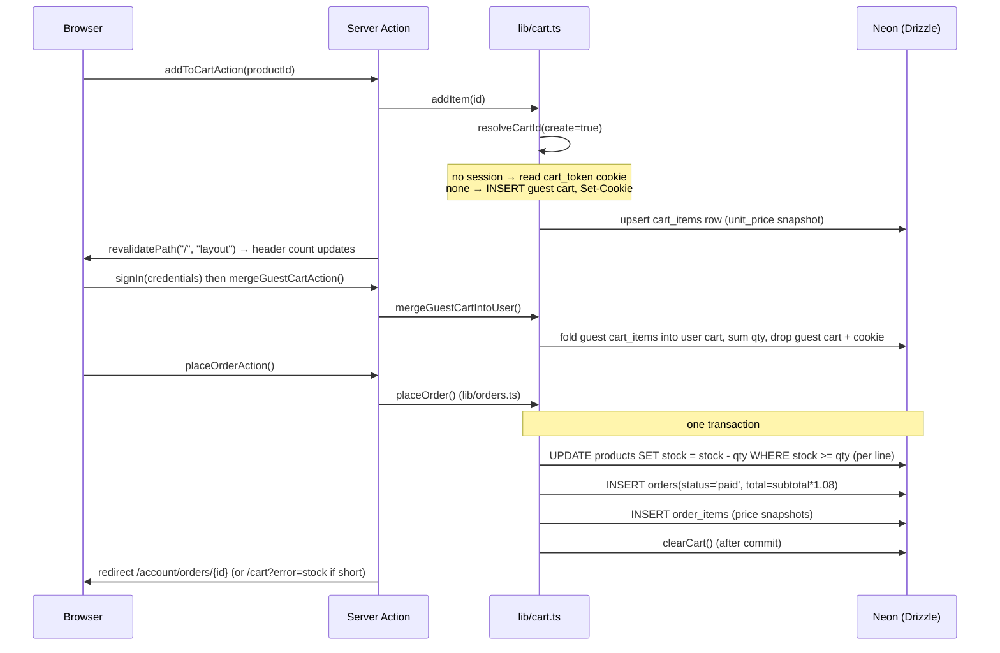
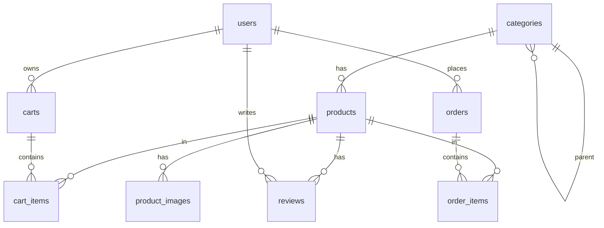

# Homebuzz — Technical Guide

A self-contained reference for the Homebuzz codebase: architecture, data model, subsystems, operations, and the non-obvious decisions behind them. Read this before doing non-trivial work.

**Companion docs:** [CONCEPTS.md](CONCEPTS.md) explains unfamiliar patterns anchored to how this project uses them — RSC, Server Actions, Auth.js sessions, Drizzle, and the data model. [WALKTHROUGH.md](WALKTHROUGH.md) traces each major feature end-to-end with annotated code excerpts. [ROADMAP.md](ROADMAP.md) tracks what's shipped and what comes next. Read this guide for the *what* and *why*; read those for the *how* and *how-it-connects*.

> **Note on this version of Next.js.** Per `AGENTS.md`, this project pins **Next.js 16.2.7** and its conventions may differ from older docs. The canonical guides ship inside `node_modules/next/dist/docs/` — read the relevant one before writing framework code.

---

## 1. What This Is

**Mission (one line):** A Home-Depot-style e-commerce storefront for home-improvement / hardware goods — browse a catalog, add to cart (as guest or signed-in), check out into an order, review products, and manage the catalog as an admin.

**Current state:** Actively developed toward production. Targeted for deployment on Vercel + Neon but **not yet deployed**. Payments are not implemented (see §6.4 and §17).

**Roles:**

| Role | Capabilities |
| ------ | -------------- |
| Guest (anonymous) | Browse catalog, search, build a cookie-backed cart |
| `customer` | Everything a guest can do + checkout, order history, write reviews |
| `admin` | Everything a customer can do + product CRUD under `/admin` |

**Major moving parts:** This is a single Next.js 16 App Router application — there is no separate API service or worker. The server is split into three layers:

1. **Server Components** (pages under `app/`) read data directly via `lib/*` query helpers.
2. **Server Actions** (`app/actions/*`) handle all mutations (cart, auth, orders, reviews, admin).
3. **Auth.js (NextAuth v5)** provides credential-based sessions via a single catch-all route handler.

Persistence is **Neon Postgres** accessed through **Drizzle ORM**.

---

## 2. Architecture



> See [CONCEPTS.md](CONCEPTS.md) for a plain-English explanation of why each layer exists and what it can and cannot do.

### 2.1 Representative end-to-end flow — "guest adds an item, signs in, checks out"



Numbered walkthrough:

1. **Add to cart.** [components/cart/AddToCartButton.tsx](components/cart/AddToCartButton.tsx) calls `addToCartAction` ([app/actions/cart.ts](app/actions/cart.ts)).
2. `addItem` ([lib/cart.ts](lib/cart.ts)) calls `resolveCartId(true)`. No session → reads the `cart_token` httpOnly cookie; if absent it inserts a guest cart and sets the cookie.
3. The cart line is upserted into `cart_items` with `unit_price` copied from the product at add-time.
4. The action calls `revalidatePath("/", "layout")` so the header cart count re-renders.
5. **Sign in.** [components/auth/AuthForm.tsx](components/auth/AuthForm.tsx) calls Auth.js `signIn("credentials", …)`, then explicitly calls `mergeGuestCartAction()`.
6. `mergeGuestCartIntoUser` folds the guest cart into the user's cart (summing shared products), deletes the guest cart, and clears the cookie.
7. **Checkout.** [app/cart/page.tsx](app/cart/page.tsx)'s checkout button → `placeOrderAction` → `placeOrder` ([lib/orders.ts](lib/orders.ts)). In one transaction it decrements each line's `stock` (rejecting oversell), inserts an `orders` row with `status='paid'` and `total = subtotal × 1.08`, and inserts `order_items` (price snapshots); on commit it clears the cart and redirects to the order detail page (or back to `/cart?error=stock` if a line was short). See §6.4.

> See [WALKTHROUGH.md](WALKTHROUGH.md) for annotated, step-by-step traces of each of these flows.

---

## 3. Repository Structure

```text
homebuzz/
├── app/                          # Next.js App Router (pages, actions, routes)
│   ├── layout.tsx                # Root layout: Header + Footer, Inter font, metadata template
│   ├── page.tsx                  # Home: hero, popular products (first 8), promo blocks
│   ├── globals.css               # Tailwind v4 @theme tokens (colors, display/heading text)
│   ├── actions/                  # Server Actions — ALL mutations live here
│   │   ├── admin.ts              # saveProductAction / deleteProductAction (admin-gated)
│   │   ├── auth.ts               # registerUser (signup)
│   │   ├── cart.ts               # add/setQty/remove/clear/mergeGuestCart
│   │   ├── orders.ts             # placeOrderAction (checkout)
│   │   └── reviews.ts            # submitReviewAction
│   ├── api/auth/[...nextauth]/route.ts  # Auth.js GET/POST handler (re-exported from auth.ts)
│   ├── store/page.tsx            # Catalog + search (?q=)
│   ├── store/[category]/page.tsx # Category-filtered catalog (statically generated params)
│   ├── product/[slug]/page.tsx   # PDP: details, related, reviews, add-to-cart
│   ├── cart/page.tsx             # Cart view + order summary + checkout
│   ├── account/page.tsx          # Profile + order history (auth-gated)
│   ├── account/orders/[id]/page.tsx  # Order detail (ownership-checked)
│   ├── admin/layout.tsx          # Admin shell — redirects non-admins to /
│   ├── admin/products/…          # Product list / new / edit
│   ├── signin|signup/page.tsx    # Auth pages (render AuthForm)
│   └── help|privacy/page.tsx     # Static content pages
├── auth.ts                       # NextAuth v5 config: Credentials provider, JWT callbacks
├── components/
│   ├── blocks/                   # Header, Footer, MobileMenu, marketing blocks
│   ├── auth/AuthForm.tsx         # Shared signin/signup form (client)
│   ├── cart/                     # AddToCartButton, CartControls, ProductPurchase (client)
│   ├── store/                    # ProductCard/Grid, CategorySidebar, ReviewForm, Stars, PricePer
│   ├── admin/                    # ProductForm, DeleteProductButton (client)
│   └── ui/                       # Button, Input, Badge primitives
├── db/
│   ├── index.ts                  # Drizzle client (postgres-js, prepare:false, max:5)
│   ├── schema.ts                 # All tables, enums, relations, inferred types
│   ├── seed.ts                   # Idempotent seed: 2 users, 15 categories, products
│   └── migrations/               # drizzle-kit generated SQL + snapshots
├── lib/                          # Domain logic + queries (most are "server-only")
│   ├── cart.ts                   # Cart resolution, items, guest→user merge
│   ├── orders.ts                 # placeOrder, getOrders, getOrder; TAX_RATE
│   ├── reviews.ts                # getReviews, upsertReview, rating recompute
│   ├── admin.ts                  # isAdmin guard + product CRUD + slug uniqueness
│   ├── products.ts               # Catalog queries + getCategories (NOT server-only)
│   ├── categories.ts             # Seed category list + slugify() (seed/admin only)
│   ├── mock-products.ts          # Seed product data
│   ├── validation.ts             # Zod schemas (signin/signup/review/product)
│   ├── types.ts                  # Frontend Product type
│   └── utils.ts                  # cn() (clsx+twMerge), formatPrice() (USD)
├── types/next-auth.d.ts          # Session/JWT augmentation (id + role)
├── tests/
│   ├── unit/                     # Vitest: categories, utils, validation
│   └── e2e/shop.spec.ts          # Playwright: browse/search/add-to-cart
├── docs/PLAN_ORIGINAL.md                  # Rebuild rationale (3 legacy repos → this one)
├── SETUP.md                      # First-run setup steps
├── drizzle.config.ts             # Uses DATABASE_URL_UNPOOLED for migrations
└── playwright.config.ts / vitest.config.ts
```

---

## 4. Tech Stack

| Layer | Technology | Why (specific to this project) |
| ------- | ----------- | ------------------------------- |
| Framework | Next.js 16.2.7 (App Router) | Single deployable for UI + server logic; Server Components read the DB directly, Server Actions handle mutations without a hand-written API layer. |
| UI runtime | React 19.2 | Required by Next 16; enables async Server Components and `useFormStatus`-style action UX. |
| Language | TypeScript 5 | Type-safe Drizzle row inference and Zod-inferred form types. |
| Styling | Tailwind CSS v4 (`@tailwindcss/postcss`) | Design tokens declared with `@theme` in [app/globals.css](app/globals.css) (`--color-ink-900`, `--text-display`, etc.) — no separate config file. |
| ORM | Drizzle ORM 0.45 | Typed SQL with `$inferSelect` row types; lightweight vs. a heavier ORM. |
| DB driver | `postgres` (postgres-js) 3.4 | Works with Neon's pooler; `prepare:false` required (see §11). |
| Database | Neon Postgres | Serverless Postgres; pooled + direct endpoints map cleanly to app vs. migrations. |
| Auth | NextAuth (Auth.js) v5 beta + `bcryptjs` | Credentials provider with JWT sessions; no external IdP needed for a self-hosted store. |
| Validation | Zod 4 | One schema reused on both the client form and the server action. |
| Forms | react-hook-form 7 + `@hookform/resolvers` | Client-side validation wired to the Zod schemas. |
| Testing | Vitest 4 (unit) + Playwright 1.60 (e2e) | Fast pure-function unit tests + a smoke-level browser flow. |

---

## 5. Data Architecture

Postgres via Drizzle ([db/schema.ts](db/schema.ts)). Two enums:

- `user_role`: `customer` | `admin`
- `order_status`: `pending` | `paid` | `shipped` | `delivered` | `cancelled`



> See [CONCEPTS.md](CONCEPTS.md) for a plain-English explanation of the tables, relationships, and key design decisions (price snapshots, denormalized ratings, upsert patterns).

### 5.1 `categories`

| Column | Type | Purpose |
| -------- | ------ | --------- |
| `id` | serial PK | |
| `name` | text not null | Display name (e.g. "Paint & Building Materials") |
| `slug` | text not null, **unique** | Routing key for `/store/:slug` |
| `icon` | text nullable | Optional icon reference |
| `parent_id` | integer nullable | Self-reference for subcategories (no FK constraint; currently unused) |

### 5.2 `products`

| Column | Type | Purpose |
| -------- | ------ | --------- |
| `id` | serial PK | |
| `slug` | text not null, **unique** | PDP route key `/product/:slug` |
| `title` | text not null | |
| `description` | text not null default `''` | |
| `price` | numeric(10,2) not null | Stored as string; convert with `Number()` |
| `unit` | text not null default `'each'` | e.g. "gallon", "each" |
| `currency` | text not null default `'USD'` | |
| `rating_avg` | numeric(2,1) not null default `'0'` | Denormalized; recomputed on review write |
| `rating_count` | integer not null default `0` | Denormalized |
| `stock` | integer not null default `0` | Decremented atomically at checkout; oversell is rejected (§6.4) |
| `sku` | text nullable | |
| `image` | text not null default `''` | Primary image path; admin input requires a non-empty local `/…` path (§15) |
| `on_sale` | boolean not null default `false` | Sale items sort first |
| `category_id` | integer not null → `categories.id` `ON DELETE restrict` | |
| `created_at` / `updated_at` | timestamp not null default now | `updated_at` set manually on update |

Indexes: `products_slug_idx` (unique), `products_category_idx`.

### 5.3 `product_images`

| Column | Type | Purpose |
| -------- | ------ | --------- |
| `id` | serial PK | |
| `product_id` | integer not null → `products.id` `ON DELETE cascade` | |
| `url` / `alt` / `position` | text / text / integer | Gallery image (table exists; gallery UI not yet built) |

### 5.4 `users`

| Column | Type | Purpose |
| -------- | ------ | --------- |
| `id` | serial PK | |
| `email` | text not null, **unique** | Login identifier |
| `password_hash` | text not null | bcrypt hash (cost 10) |
| `name` | text not null | |
| `role` | `user_role` not null default `customer` | |
| `created_at` / `updated_at` | timestamp | |

### 5.5 `carts` & `cart_items`

`carts`: `id`, `user_id` (nullable → `users.id` cascade), `token` (nullable; guest cookie token), timestamps. Index `carts_user_idx`. A cart is keyed by **either** `user_id` (signed-in) **or** `token` (guest), never both at once in practice.

`cart_items`: `id`, `cart_id` (→ `carts.id` cascade), `product_id` (→ `products.id` cascade), `quantity` (default 1), `unit_price` numeric(10,2) — **a price snapshot taken at add-time**.

### 5.6 `orders` & `order_items`

`orders`: `id`, `user_id` (not null → `users.id` `restrict`), `status` (`order_status` default `pending`), `total` numeric(10,2), `created_at`.

`order_items`: `id`, `order_id` (→ `orders.id` cascade), `product_id` (→ `products.id` `restrict`), `quantity`, `unit_price` (snapshot).

### 5.7 `reviews`

| Column | Type | Purpose |
| -------- | ------ | --------- |
| `id` | serial PK | |
| `product_id` | integer not null → `products.id` cascade | Index `reviews_product_idx` |
| `user_id` | integer not null → `users.id` cascade | One review per (product,user) enforced in code, not by a DB constraint |
| `rating` | integer not null | 1–5 |
| `body` | text not null default `''` | ≤1000 chars (Zod) |
| `created_at` | timestamp | |

### 5.8 Order status lifecycle

The enum defines five states, but the code only ever **inserts `paid`**:

```text
pending ──(unused)──┐
                    ▼
   placeOrder() ─► paid ──► shipped ──► delivered   (shipped/delivered/cancelled
                    │                                 are NOT reachable in code)
                    └──► cancelled
```

> The `pending`, `shipped`, `delivered`, and `cancelled` states are **speculative** — no code transitions an order into them, and there is no admin order-management UI. Treat them as aspirational placeholders, not a wired state machine.

---

## 6. Core Subsystems

### 6.1 Authentication & Authorization

- **Config:** [auth.ts](auth.ts) — NextAuth v5 with a single **Credentials** provider, `session.strategy = "jwt"`, `trustHost: true`, custom sign-in page `/signin`.
- **Login:** `authorize` validates input with `signInSchema`, looks up the user by email, and `bcrypt.compare`s the password. On success it returns `{ id, email, name, role }`.
- **Session shape:** JWT/session callbacks copy `id` and `role` onto the token and session. The `Session`/`JWT` types are augmented in [types/next-auth.d.ts](types/next-auth.d.ts).
- **Signup:** not a provider — it's `registerUser` in [app/actions/auth.ts](app/actions/auth.ts): validate with `signUpSchema`, reject duplicate email, `bcrypt.hash(password, 10)`, insert.
- **Route guarding:** there is **no `middleware.ts`**. Guards are per-surface, server-side:
  - Admin: [app/admin/layout.tsx](app/admin/layout.tsx) and every admin action call `isAdmin()` ([lib/admin.ts](lib/admin.ts)) and `redirect("/")` if false.
  - Account/order pages call `auth()` and `redirect("/signin")` if no session.
- **HTTP handler:** [app/api/auth/\[...nextauth\]/route.ts](app/api/auth/%5B...nextauth%5D/route.ts) just re-exports `handlers` from `auth.ts`.

> See [WALKTHROUGH.md — Sign up](WALKTHROUGH.md) and [Sign in + merge guest cart](WALKTHROUGH.md) for end-to-end traces.

### 6.2 Cart (guest + user, with merge)

Lives in [lib/cart.ts](lib/cart.ts); mutations exposed via [app/actions/cart.ts](app/actions/cart.ts). Key behaviors:

- `resolveCartId(create)` is the heart of it: signed-in → cart keyed by `user_id`; guest → cart keyed by the `cart_token` httpOnly cookie (`sameSite: lax`, 30-day max-age). The `create` flag **must only be true inside a Server Action / Route Handler**, since it may set a cookie (forbidden during render).
- `addItem` snapshots `unit_price` from the product and upserts the line (sums quantity if it exists).
- `mergeGuestCartIntoUser` folds the guest cart into the user cart on login, summing shared products, then deletes the guest cart and cookie. It is invoked **explicitly from the client** after `signIn` in [components/auth/AuthForm.tsx](components/auth/AuthForm.tsx) — it is not an Auth.js callback (see §15).
- Every cart action calls `revalidatePath("/", "layout")` because the header cart count lives in the root layout.

> See [WALKTHROUGH.md — Add to cart (guest)](WALKTHROUGH.md) for an end-to-end trace.

### 6.3 Reviews

[lib/reviews.ts](lib/reviews.ts) + [app/actions/reviews.ts](app/actions/reviews.ts). `upsertReview` is **purchase-gated**: it returns `{ ok: false, reason: "unauthenticated" | "not_purchased" }` unless the user has an `order_items` row (joined to their `orders`) for that product, via the `hasPurchased` helper. It then enforces one review per (product, user) **in code** (lookup-then-insert-or-update) and calls `recomputeProductRating` to recompute `products.rating_avg` / `rating_count` from the `reviews` table. The PDP revalidates after submit, and uses the exported `canReview(productId)` to decide whether to render `ReviewForm` or a "only customers who ordered this can review" notice.

> See [WALKTHROUGH.md — Submit a review](WALKTHROUGH.md) for an end-to-end trace.

### 6.4 Orders / Checkout

[lib/orders.ts](lib/orders.ts) + [app/actions/orders.ts](app/actions/orders.ts). `placeOrder` requires a session and a non-empty cart, computes `total = subtotal × (1 + TAX_RATE)` where `TAX_RATE = 0.08`, then runs a **single transaction** that: (1) decrements each product's `stock` atomically via `UPDATE … SET stock = stock - qty WHERE id = ? AND stock >= qty` — a row only updates while enough remains, so concurrent checkouts can't oversell; (2) inserts the order **directly as `status='paid'`**; (3) snapshots line prices into `order_items`. If any line is short, an `OutOfStockError` rolls the whole transaction back and `placeOrder` returns `{ ok: false, reason: "out_of_stock", items }` — the cart is left intact and `placeOrderAction` redirects to `/cart?error=stock` (which renders an inline banner). On success the cart is cleared. `getOrder(id)` is **ownership-checked** (`WHERE id = … AND user_id = …`) so users can't read others' orders.

> **No real payment processing exists.** `placeOrder` marks orders paid unconditionally. Real payments (e.g. Stripe) + the accompanying webhooks/emails are planned future work (§17).
>
> See [WALKTHROUGH.md — Checkout](WALKTHROUGH.md) for an end-to-end trace including the stock-check transaction.

### 6.5 Admin product management

[lib/admin.ts](lib/admin.ts) (server-only) + [app/actions/admin.ts](app/actions/admin.ts). `isAdmin()` gates every operation. `createProduct`/`updateProduct` derive a unique slug via `uniqueSlug` (slugify the title; on collision append the last 5 digits of `Date.now()`). `saveProductAction` validates with `productSchema`, then `revalidateCatalog()` busts `/admin/products`, `/store`, and `/`. `deleteProductAction` catches the `order_items` FK violation and returns a friendly error for products that have been ordered (§15). There is no admin order or user management — products only.

> See [WALKTHROUGH.md — Admin saves a product](WALKTHROUGH.md) for an end-to-end trace.

### 6.6 Catalog queries

[lib/products.ts](lib/products.ts) — the one `lib` module that is **not** `server-only` (so it can be reached from `generateStaticParams`). `getProducts({ category, q })` joins products↔categories, supports an `ilike` search over title+description, and orders `on_sale DESC, id`. `getRelatedProducts` picks random same-category products via `ORDER BY random()`. `getCategories()` returns the nav category list (`{ name, slug }`, insertion order) straight from the `categories` table — the `Header`, `MobileMenu`, `CategorySidebar`, and `/store/[category]` all source categories from it (DB-driven, not the static `lib/categories.ts` list, which now serves only the seed + `slugify`).

> See [WALKTHROUGH.md — Browse / search catalog](WALKTHROUGH.md) for an end-to-end trace.

---

## 7. API Reference

There is **no REST/GraphQL API**. All server interaction is via Server Actions (not addressable URLs) plus one Auth.js route. The only HTTP endpoints:

| Method | Path | Access | Purpose |
| -------- | ------ | -------- | --------- |
| GET/POST | `/api/auth/[...nextauth]` | Public | Auth.js sign-in / sign-out / session / CSRF |

Server Actions (invoked via React, not fetched directly):

| Action | File | Access | Purpose |
| -------- | ------ | -------- | --------- |
| `registerUser` | actions/auth.ts | Public | Create account |
| `addToCartAction` / `setQtyAction` / `removeItemAction` / `clearCartAction` | actions/cart.ts | Public (guest ok) | Cart mutations |
| `mergeGuestCartAction` | actions/cart.ts | Auth (no-op if guest) | Fold guest cart on login |
| `placeOrderAction` | actions/orders.ts | Auth (redirects to /signin) | Checkout |
| `submitReviewAction` | actions/reviews.ts | Auth (returns error if not) | Add/update review |
| `saveProductAction` / `deleteProductAction` | actions/admin.ts | Admin (redirects to /) | Product CRUD |

---

## 8. Frontend

Server Components fetch data; small Client Components own interactivity. **Server state** comes from `lib/*` reads + `revalidatePath` after actions; there is **no client data-fetching/state library** (no React Query, no Redux). Local UI state uses `useState` + react-hook-form.

| Route | File | Notable behavior |
| ------- | ------ | ------------------ |
| `/` | [app/page.tsx](app/page.tsx) | Hero + first 8 products + marketing blocks |
| `/store` | [app/store/page.tsx](app/store/page.tsx) | Catalog; `?q=` search; sidebar of categories |
| `/store/[category]` | [app/store/\[category\]/page.tsx](app/store/%5Bcategory%5D/page.tsx) | Category filter; `generateStaticParams` over the 15 categories; `notFound()` on bad slug |
| `/product/[slug]` | [app/product/\[slug\]/page.tsx](app/product/%5Bslug%5D/page.tsx) | PDP: details, related, reviews; `generateStaticParams` over all product slugs |
| `/cart` | [app/cart/page.tsx](app/cart/page.tsx) | Line items, qty controls, summary (`TAX_RATE` from `lib/orders`), checkout; shows a stock banner on `?error=stock` |
| `/account` | [app/account/page.tsx](app/account/page.tsx) | Auth-gated; profile + order history; sign-out via inline server action |
| `/account/orders/[id]` | [app/account/orders/\[id\]/page.tsx](app/account/orders/%5Bid%5D/page.tsx) | Ownership-checked order detail; back-computes subtotal/tax from `total` |
| `/admin/products` (+ `/new`, `/[id]/edit`) | [app/admin/products/](app/admin/products/) | Admin-gated CRUD; wraps `ProductForm` |
| `/signin`, `/signup` | [app/signin/page.tsx](app/signin/page.tsx), [app/signup/page.tsx](app/signup/page.tsx) | Render shared `AuthForm` |
| `/help`, `/privacy` | [app/help/page.tsx](app/help/page.tsx), [app/privacy/page.tsx](app/privacy/page.tsx) | Static content |

Navigation: persistent `Header`/`Footer` in the root layout; `MobileMenu` for small screens. Design tokens (colors, `text-display`, `text-heading`) are defined with Tailwind v4 `@theme` in [app/globals.css](app/globals.css).

---

## 9. Testing

> See [TESTING.md](TESTING.md) for how to run tests, how to add new ones, and a prioritised list of coverage gaps.

| Level | Tool | Location | Count | Covers |
| ------- | ------ | ---------- | ------- | -------- |
| Unit | Vitest (node env) | [tests/unit/](tests/unit/) | 19 tests / 3 files | `slugify` + categories, `cn`/`formatPrice` utils, all Zod schemas (incl. the local-image-path rule) |
| E2E | Playwright (Chromium) | [tests/e2e/shop.spec.ts](tests/e2e/shop.spec.ts) | 3 tests | Browse catalog, search `?q=drill`, add-to-cart → cart total |

Playwright auto-starts `npm run dev` (`reuseExistingServer: true`) and hits `http://localhost:3000`. Runs are serial (`fullyParallel: false`), no retries.

**What is NOT tested:**

- Auth flows (signin/signup/session/role gating) — no coverage.
- Checkout / `placeOrder`, order history, ownership checks.
- Reviews and rating recompute.
- Admin product CRUD and the `isAdmin` guard.
- Guest→user cart merge (`mergeGuestCartIntoUser`).
- Any `lib/*` query logic at the integration level (no DB-backed tests).

---

## 10. Local Development

**Prerequisites:** Node 20+, a Neon Postgres database (free tier is fine).

```bash
cp .env.example .env.local      # MUST be .env.local, not .env
# fill DATABASE_URL (pooled), DATABASE_URL_UNPOOLED (direct), AUTH_SECRET
npm install
npm run db:migrate              # create tables (applies db/migrations)
npm run db:seed                 # 2 users, 15 categories, products
npm run dev                     # http://localhost:3000
```

Seeded logins (password `password1234` for both):

- `demo@homebuzz.test` — customer
- `admin@homebuzz.test` — admin

Other commands: `npm run db:generate` (migration from schema), `npm run db:studio` (Drizzle Studio), `npm run build` / `npm start`, `npm run lint`, `npm test`, `npm run test:e2e`.

**Common issues:**

| Symptom | Fix |
| --------- | ----- |
| `relation "products" does not exist` | Tables not created — run `db:migrate` then `db:seed`. |
| `DATABASE_URL is not set` | Env file is `.env`, not `.env.local`. Rename it. |
| Interactive prompt error on `db:push` | Use `npm run db:migrate` instead — `db:push` needs a real TTY; don't use it in scripts/CI. |

---

## 11. Environment Variables

| Name | Required | Secret | Purpose |
| ------ | ---------- | -------- | --------- |
| `DATABASE_URL` | Yes | Yes | **Pooled** Neon connection (host contains `-pooler`). Used by the app at runtime. Read in [db/index.ts](db/index.ts). |
| `DATABASE_URL_UNPOOLED` | Yes (for migrations) | Yes | **Direct** Neon connection (no `-pooler`). Used by `drizzle-kit` ([drizzle.config.ts](drizzle.config.ts)). |
| `AUTH_SECRET` | Yes | Yes | NextAuth JWT signing secret. Generate with `npx auth secret`. |

Local values go in `.env.local` (loaded automatically by Next at runtime, and explicitly by `drizzle.config.ts` / `db:seed` via `process.loadEnvFile`).

---

## 12. Deployment

**Target (not yet deployed):** Vercel + Neon.

- **Build command:** `npm run build` (`next build`); **start:** `next start`.
- **Env vars:** set `DATABASE_URL`, `DATABASE_URL_UNPOOLED`, `AUTH_SECRET` in the Vercel project (all three environments).
- **Branch flow:** `main` is the production branch; Vercel will give preview deploys per PR/branch.
- **Migrations:** run `npm run db:migrate` against `DATABASE_URL_UNPOOLED` as part of release — **do not** rely on `db:push` (needs a TTY).
- **No crons, queues, or workers** are configured or planned in the near term.
- **`next build` needs a reachable DB.** `generateStaticParams` in `/product/[slug]` and `/store/[category]` calls `getProducts`/`getCategories`, so the build queries Neon — `DATABASE_URL` must be present (and the DB migrated/seeded) in the build environment, or the build fails collecting params.

> Two-URL gotcha at deploy time: the app must use the **pooled** URL (`prepare:false`), migrations the **direct** URL. Mixing them up surfaces as prepared-statement errors against the pooler (§15).

---

## 13. Security Model

- **Authorization boundaries** are enforced server-side at each surface (no middleware): admin actions + `app/admin/layout.tsx` check `isAdmin()`; account/order pages check `auth()`; `getOrder` additionally scopes by `user_id` so order detail is owner-only.
- **Passwords** are hashed with bcrypt (cost 10) and never returned to the client; the `authorize` callback returns only `id/email/name/role`.
- **Sessions** are stateless JWTs signed with `AUTH_SECRET`; `role` is embedded in the token.
- **Input validation:** every mutation re-validates with Zod **on the server** (`signInSchema`, `signUpSchema`, `reviewSchema`, `productSchema`) regardless of client validation.
- **Cookies:** the guest `cart_token` is `httpOnly`, `sameSite: lax`, path `/`, 30-day max-age.
- **SQL injection:** all queries go through Drizzle's parameterized builder (including `ilike` search terms).
- **Reviews are purchase-gated:** `upsertReview` rejects users without a matching `order_items` row (§6.3), and the PDP hides the form from non-purchasers via `canReview`.
- **Image paths are required and constrained** to local `/public` paths by `productSchema` so admin input can't leave `next/image` with an empty `src` or point it at an unconfigured remote host (§15).
- **Signup race:** `registerUser` does a read-then-insert duplicate-email check, and additionally catches the unique-violation (SQLSTATE `23505`) from `users_email_idx` so two concurrent signups can't both succeed.

---

## 14. Key Patterns

1. **Server Actions for all writes; Server Components for all reads.** No bespoke API layer. Match this — put new mutations in `app/actions/*` delegating to a `server-only` `lib/*` module.
2. **`lib/*` is the domain layer and is `server-only`** — except [lib/products.ts](lib/products.ts), which is deliberately not, so `generateStaticParams` can call it. Don't add `server-only` to it.
3. **Price snapshots.** `cart_items.unit_price` and `order_items.unit_price` copy the product price at the time of the action. (This is currently incidental, not a deliberate price-lock guarantee — see §15.)
4. **Denormalized ratings.** `products.rating_avg`/`rating_count` are derived columns recomputed by `recomputeProductRating` on every review write. Never edit them directly.
5. **`numeric` columns are strings.** Drizzle returns `price`/`total`/`unit_price` as strings — always `Number()` on read and `.toFixed(2)` on write.
6. **Targeted revalidation.** After a mutation, call `revalidatePath`. Cart actions revalidate `("/", "layout")` because the count lives in the root layout; checkout also busts `/store` (stock changed); admin actions bust `/admin/products`, `/store`, `/`.
7. **Slug uniqueness in app code** (`uniqueSlug`), not via DB upsert — relies on the unique index as a backstop.
8. **Two Postgres connections by role:** pooled for the app (`prepare:false`, `max:5`), direct for migrations.

---

## 15. Gotchas

- **Cart merge is client-triggered.** `mergeGuestCartIntoUser` is **not** an Auth.js `signIn` callback — [components/auth/AuthForm.tsx](components/auth/AuthForm.tsx) calls `mergeGuestCartAction()` right after `signIn`. If you add another login path, you must call the merge yourself or guest carts silently strand.
- **`signIn` is intentionally client-side here.** NextAuth v5 (confirmed in the installed `next-auth@5.0.0-beta.31` type definitions) supports calling `signIn` from a Server Action: `await signIn("credentials", formData)` inside a `"use server"` function. The app does **not** use this pattern for three reasons: (1) server-side `signIn` always redirects or throws `AuthError` — there is no `redirect: false` option, so inline field errors are impossible; (2) the cart merge must run after the session is established but before the redirect, which the server action flow cannot accommodate; (3) per-field validation via `react-hook-form` would be lost. If you later add OAuth (GitHub, Google), the server action pattern is the right choice for those providers since they don't need error feedback or a cart merge.
- **Stock is enforced only at checkout, not on add-to-cart.** `addItem` does not pre-check `products.stock` — the cart can hold more than exists. The atomic decrement in `placeOrder` (§6.4) is the real guard; an over-quantity cart fails checkout with the `?error=stock` banner rather than at add time.
- **Cart quantities must be positive integers.** `addItem`/`setItemQuantity` ([lib/cart.ts](lib/cart.ts)) reject non-integer or `< 1` quantities (the former no-ops, the latter falls through to `removeItem`). This matters because Server Actions are callable directly with arbitrary arguments — without this guard, a crafted negative quantity would flow into `placeOrder`'s `gte(products.stock, i.quantity)` check (always true for negative numbers), letting a user inflate `products.stock` and produce a "paid" order with a negative total.
- **Cart quantities are capped at 999.** `addItem`/`setItemQuantity` also reject quantities `> 999` (no-ops/clamp respectively). This prevents integer overflow on `cart_items.quantity` (Postgres `int4` max 2,147,483,647, but payloads built from untrusted quantity values can exceed it) and downstream numeric overflow in `placeOrder` when computing the order total (constrained to `numeric(10,2)` with max ~100M). Overflow would throw an uncaught Postgres error, crashing the cart or checkout action — the cap prevents that while remaining user-friendly.
- **Emails are normalized to lowercase/trimmed at the schema layer.** `signInSchema`/`signUpSchema` ([lib/validation.ts](lib/validation.ts)) apply `.trim().toLowerCase()` before the `email()` check, so `users.email` lookups (`authorize`, `registerUser`) are case-insensitive going forward. Rows inserted *before* this change may still have mixed-case emails and won't match a lowercase login — there's no backfill migration for existing data.
- **Prepared statements disabled on purpose.** Neon's pooled endpoint runs PgBouncer in transaction mode, which breaks prepared statements — hence `prepare:false` in [db/index.ts](db/index.ts). Migrations must use the **direct** URL or DDL fails.
- **`.env.local`, not `.env`.** Both `drizzle.config.ts` and `db:seed` explicitly load `.env.local`; a `.env` file yields `DATABASE_URL is not set`.
- **`db:push` needs a TTY** — it prompts interactively. Use `db:migrate` in any non-interactive context.
- **`db:seed` clears orders/carts/reviews too, in FK-safe order.** [db/seed.ts](db/seed.ts) deletes `order_items` → `orders` → `cart_items` → `carts` → `reviews` before `products`/`categories`/`users`, since `orders.user_id` and `order_items.product_id` are `ON DELETE restrict`. Without that order, a reseed after any checkout would throw a restrict-violation (`23001`) on `db.delete(productsTable)`. Re-running `db:seed` is a full reset — it wipes order history, not just the catalog.
- **Order states are mostly fiction.** Only `paid` is ever written; `pending`/`shipped`/`delivered`/`cancelled` have no transitions (§5.8).
- **`product_images` and `categories.parent_id` exist but are unused** by the current UI — tables/columns reserved for future galleries and subcategories.
- **Category nav comes from the DB but there's no category CRUD.** `Header`/`MobileMenu`/`CategorySidebar`/`/store/[category]` all read `getCategories()` (the `categories` table) — but rows are only ever created by the seed; there is no admin UI to add/rename/delete a category. `lib/categories.ts` is now seed-and-`slugify`-only; don't wire it back into nav. **Exception:** [Footer](components/blocks/Footer.tsx) hardcodes two category links (`/store/paint-and-building-materials`, `/store/hardware`) — if those seed slugs ever change, the footer links 404 (`notFound()`).
- **Deleting an ordered product is blocked, gracefully.** `order_items.product_id` is `ON DELETE restrict`, so a product that's been ordered can't be hard-deleted. `deleteProductAction` ([app/actions/admin.ts](app/actions/admin.ts)) catches the FK violation (`23503`) and returns `{ ok: false, error }`, which [DeleteProductButton](components/admin/DeleteProductButton.tsx) surfaces via `alert`. (`cart_items` and `reviews` cascade; only `order_items` blocks.) There's still no soft-delete/archive — an ordered product can only be edited, not removed.
- **Product images must be a non-empty local path.** `next/image` throws on an empty `src` and on remote hosts (no `images.remotePatterns`). `productSchema` ([lib/validation.ts](lib/validation.ts)) now **requires** `image` and rejects anything not starting with `/`. As defense-in-depth, every render site (ProductCard, PDP, cart, order detail) guards `image &&` and shows a "No image" placeholder, so a legacy blank row can't crash a page.

---

## 16. Glossary

| Term | Definition |
| ------ | ------------ |
| **Guest cart** | A `carts` row with a null `user_id` and a `token`, identified by the `cart_token` httpOnly cookie. Merged into the user cart on login. |
| **Cart merge** | `mergeGuestCartIntoUser` — folds a guest cart's items into the signed-in user's cart, summing shared products, then deletes the guest cart + cookie. |
| **Price snapshot** | The `unit_price` copied onto a `cart_items`/`order_items` row at action time; not re-synced if the product price later changes. |
| **Rating recompute** | `recomputeProductRating` — recalculates `products.rating_avg`/`rating_count` from `reviews` after each review write. |
| **`server-only`** | The import marker on most `lib/*` modules that makes the build fail if they're pulled into client code. `lib/products.ts` deliberately omits it. |
| **Pooled vs. direct URL** | `DATABASE_URL` (pooled, PgBouncer, app runtime) vs. `DATABASE_URL_UNPOOLED` (direct, migrations/DDL). |
| **Slice 2 / Slice 3** | Scope phases from `docs/PLAN_ORIGINAL.md`: Slice 2 = catalog+cart+auth (v1); Slice 3 = checkout/orders/reviews/admin. |
| **`unit`** | A product's pricing unit ("each", "gallon"), display-only. |

---

## 17. Future Work

1. **Real payments.** Replace the `status='paid'`-on-insert stub in `placeOrder` with a payment provider (e.g. Stripe), including the pre-payment `pending` state and post-payment confirmation. This is the next major piece.
2. **Add-to-cart stock awareness.** Stock is now enforced at checkout (§6.4); a nicer flow would also surface remaining stock on the PDP and cap add-to-cart quantities up front.
3. **Order lifecycle + admin order management.** Wire `shipped`/`delivered`/`cancelled` transitions and an admin UI to drive them.
4. **Background work to accompany payments.** Payment webhooks and transactional email (order confirmations) — none exist today.
5. **Product image uploads + galleries.** Add real uploads (or configure `images.remotePatterns`) so images aren't limited to hand-placed `/public` files, then use the existing `product_images` table for PDP galleries.
6. **Category management + subcategories.** Nav is DB-driven (`getCategories`), but there's no admin CRUD for categories and `categories.parent_id` is still unused — add a management UI and wire subcategories.
7. **Soft-delete products.** Deleting an ordered product is currently just blocked (§15); an `archived` flag would let admins retire a product while preserving order history.
8. **Test coverage for the untested paths** in §9 (auth, checkout, reviews, admin, cart merge).
